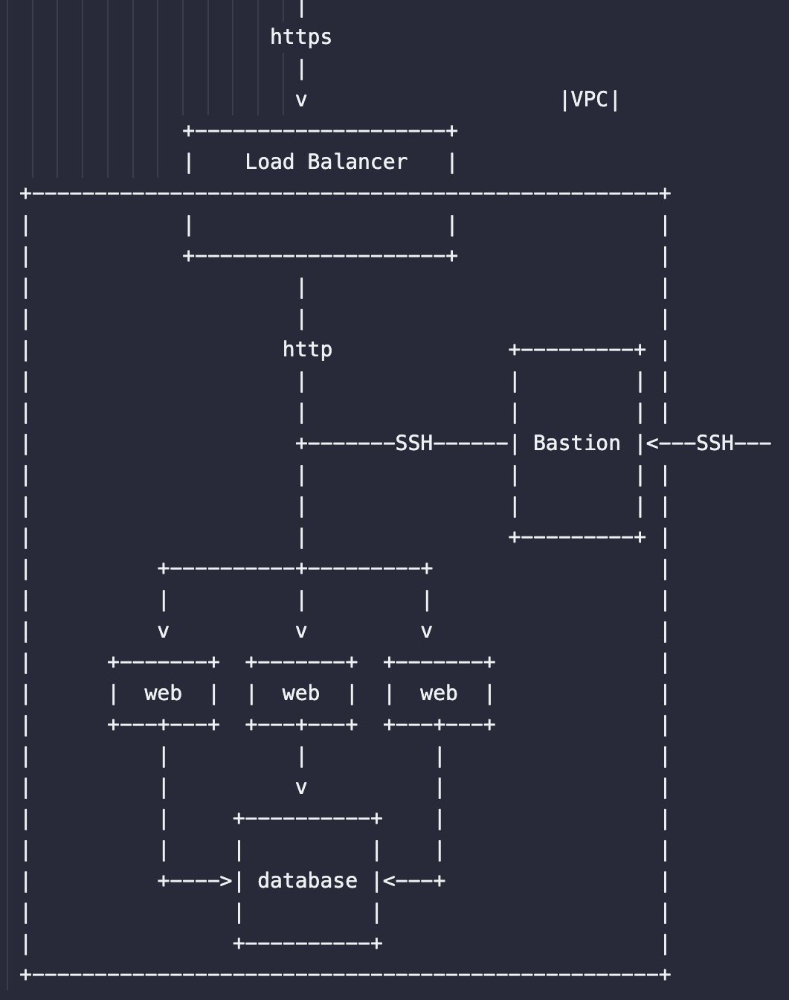

- ✅ 13. IaC on DigitalOcean Task from https://roadmap.sh/projects/iac-digitalocean

Architecture Diagram

[](architecture.png)

## Prerequisites

- A **DigitalOcean** account + **Personal Access Token (PAT)** with read/write
- A **SSH key** added to your DO account (Settings → Security → SSH Keys) that matches a private key on your machine

## Setup

```bash
export TF_VAR_do_token="dop_v1_abc123..."
terraform init
terraform apply
```

## Firewall Rules

### `digitalocean_firewall.web`

**Inbound** (who may start talking to droplets):
- `tcp/80` from VPC CIDR → the Load Balancer (in the same VPC) can hit your apps privately
- `tcp/22` from VPC CIDR → the Bastion (in the same VPC) can SSH to web droplets (private hop)
- `icmp` from VPC CIDR → ping from within VPC (handy for diagnostics)

**Outbound** (where droplets may start talking to):
- To VPC CIDR: `tcp/udp 1-65535`, `icmp` → talk freely to DB, LB, other services inside VPC
- To Internet: `udp/53` (DNS), `tcp/80` (HTTP), `tcp/443` (HTTPS), `icmp` → apt, docker pulls, APIs, ping

**What's blocked?**
- Any public inbound to web droplets (e.g., internet → droplet:80 or :22) is denied
- Any outbound not explicitly listed (e.g., SMTP 25) is denied

### `digitalocean_firewall.bastion`

**Inbound:**
- `tcp/22` from `allowed_ssh_cidrs` → only the IPs you trust may SSH to the bastion

**Outbound:**
- To VPC CIDR: `tcp/udp 1-65535`, `icmp` → bastion can SSH to web droplets and connect to DB over private IPs
- To Internet: `udp/53`, `tcp/80`, `tcp/443` → install tools/updates, fetch packages

**What's blocked?**
- Anything not listed. E.g., bastion cannot reach random internet ports unless you allow them

### `digitalocean_database_firewall.postgres-cluster`

**Rule:** allow any client with tag `${var.name}-webserver`

Because both your web droplets and bastion carry the tag `${var.name}-webserver`, the DB allows them in — over the VPC private endpoint. This DB firewall is separate from droplet firewalls and is tag-based (not IP-based). Very convenient for scaling.

## Getting Outputs

```bash
terraform output

# Specific values
terraform output -raw db_user
terraform output -raw db_password
terraform output -raw db_private_host
terraform output -raw db_port
terraform output -raw db_private_uri

terraform output -raw load_balancer_ip
terraform output -raw bastion_public_ip
```

## Testing

### Test Load Balancer (public access works)

```bash
LB_IP=$(terraform output -raw load_balancer_ip)
curl -i "http://$LB_IP"
# expect: HTTP/1.1 200 OK and body like <h1>web-...-1</h1>
```

### Test Web Droplets (public access blocked)

```bash
WEB_PUB_1=$(terraform output -raw web_droplet_1_public_ip)

# HTTP should fail / time out / get blocked
curl -I --max-time 5 "http://$WEB_PUB_1" || echo "blocked as expected"

# SSH should fail (no inbound 22 from public to web droplets)
nc -vz "$WEB_PUB_1" 22 || echo "ssh blocked as expected"
```

### SSH Access via Bastion

```bash
# Two-step
ssh -A root@<bastion_public_ip>     # -A forwards your laptop's key
ssh -A do-bastion     # -A forwards your laptop's key
# now from the bastion:
ssh root@<web_private_ip>           # still authenticates using your laptop's key

# Or one-hop from your laptop:
ssh -J root@<bastion_public_ip> root@<web_private_ip>
```

**Note:** Always use private IPs when connecting from bastion to web/db.

### From Bastion: Test Internal Network

```bash
WEB_PRIV_1=<web_private_ip>
DB_HOST=$(terraform output -raw db_private_host)
DB_PORT=$(terraform output -raw db_port)

# The web should answer on :80 over the VPC
curl -I http://$WEB_PRIV_1
# expect: HTTP/1.1 200 OK

# Firewall opened ICMP inside VPC, so ping should work
ping -c 2 $WEB_PRIV_1

# Install PostgreSQL client
apt-get update -y && apt-get install -y postgresql-client

# Test database port
nc -vz "$DB_HOST" "$DB_PORT"
# Example: nc -vz private-tf-db-cluster-do-user-12345-0.k.db.ondigitalocean.com 25060
# expect: succeeded
```

### Connect to Database

```bash
DB_USER=$(terraform output -raw db_user)
DB_PASS=$(terraform output -raw db_password)

PGPASSWORD="$DB_PASS" psql \
  "host=$DB_HOST port=$DB_PORT user=$DB_USER dbname=defaultdb sslmode=require" \
  -c "\conninfo"

# Example with actual values:
# PGPASSWORD="<YOUR_DB_PASSWORD>" psql \
#   "host=private-tf-db-cluster-do-user-12345-0.k.db.ondigitalocean.com port=25060 user=doadmin dbname=defaultdb sslmode=require" \
#   -c "\conninfo"
# or
#   -c "SELECT now();"
```

**Expected output:**
```
You are connected to database "defaultdb" as user "doadmin" 
on host "private-tf-db-cluster-do-user-12345-0.k.db.ondigitalocean.com" 
(address "192.168.22.5") at port "25060".
SSL connection (protocol: TLSv1.3, cipher: TLS_AES_256_GCM_SHA384, compression: off, ALPN: none)
```

## Cleanup

```bash
terraform destroy
```